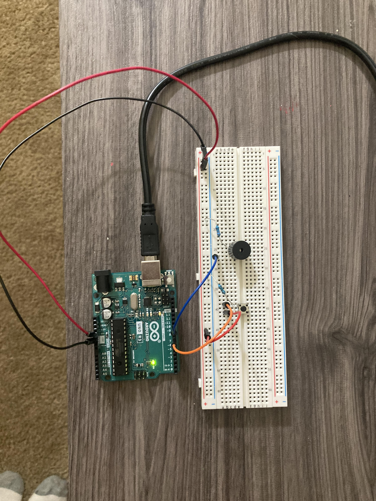

# Piezzo_Buzzer

## Equipment
1. Breadboard
2. Piezzo Buzzer
3. Five Jumper Wires
4. Switch Button
5. One 330 Ω Resister
6. One 1k Ω Resister
7. USB Cord
8. Arduino IDE
9. Arduino Uno R3 Micro-Controller

## Objective
The purpose of this project was to make a piezzo buzzer go off with a 1000 Hz frequency as long as the user presses/holds down on the switch button. 

<a href="https://user-images.githubusercontent.com/63562144/120960869-b2f6ba80-c72a-11eb-94e6-3338adc8eb71.MOV"> Live Demo</a>

